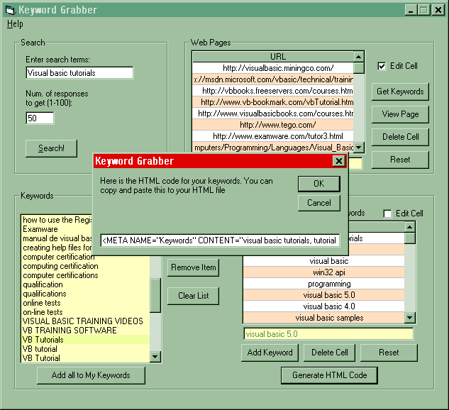



## Keyword Grabber

### Description

This program lets you enter search words and then it retrieves URLs for them. You can then get the keywords from those sites. The intention of this program is to help people achieve better ranking on search engines by helping you choose better keywords for your web site. This code will also automatically generate the proper HTML code for the keywords you choose to add to your web page. It also has Drag-and-drop support and uses MS Flex Grid.
 
### More Info
 

             |
---                |---
**Submitted On**   |2001-05-27 15:16:30
**By**             |[Ricardo Maravilla](https://github.com/Planet-Source-Code/PSCIndex/blob/master/ByAuthor/ricardo-maravilla.md)
**Level**          |Beginner
**User Rating**    |5.0 (10 globes from 2 users)
**Compatibility**  |VB 6\.0
**Category**       |[Complete Applications](https://github.com/Planet-Source-Code/PSCIndex/blob/master/ByCategory/complete-applications__1-27.md)
**World**          |[Visual Basic](https://github.com/Planet-Source-Code/PSCIndex/blob/master/ByWorld/visual-basic.md)
**Archive File**   |[Keyword Gr201465272001\.zip](https://github.com/Planet-Source-Code/ricardo-maravilla-keyword-grabber__1-23507/archive/master.zip)

